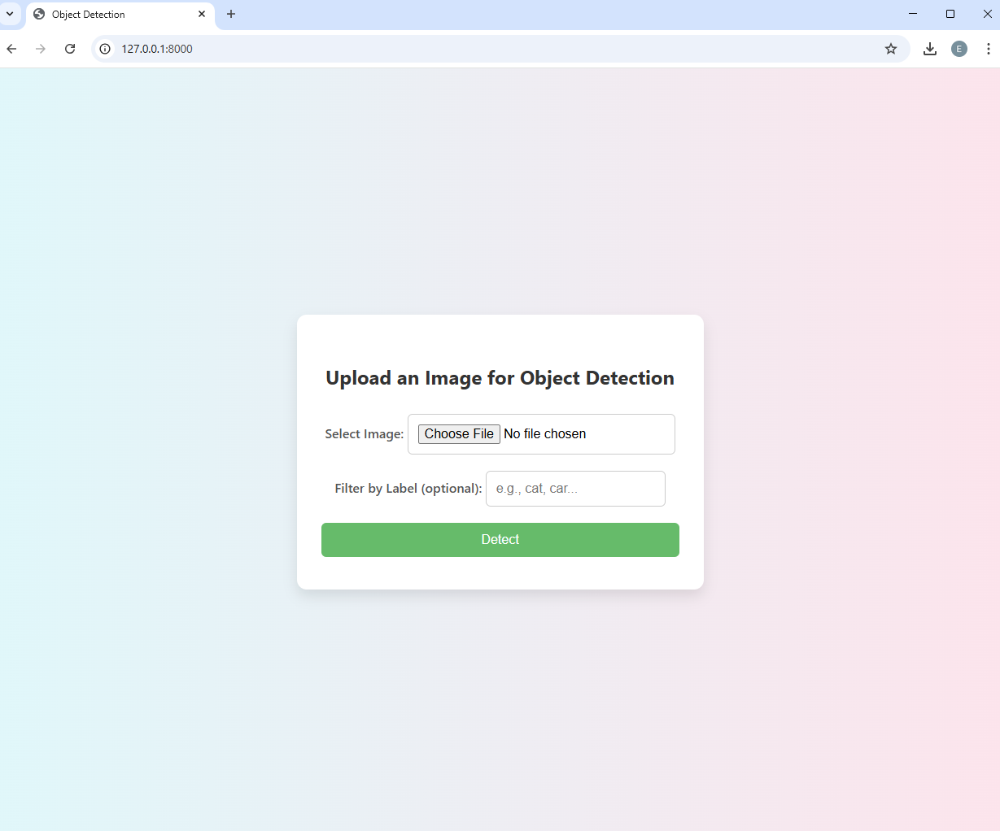
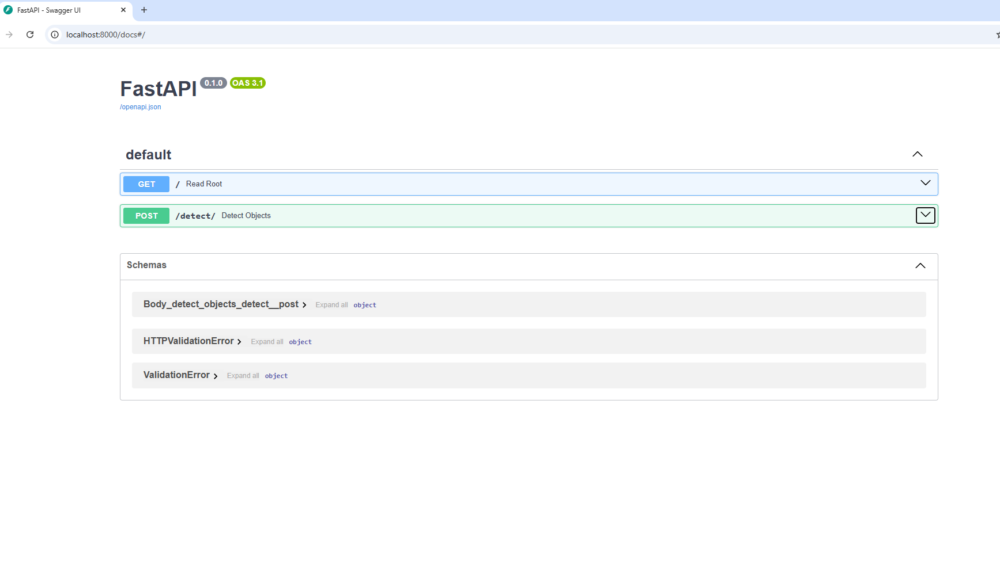

# Dockerized YOLOv8 Object Detection Microservice

A lightweight, scalable object detection microservice built using **YOLOv8**, **FastAPI**, and optionally containerized with **Docker** and orchestrated via **Docker Compose**.

---

## Project Purpose

This project aims to provide a fast, reusable, and developer-friendly microservice for real-time object detection. It enables users to upload an image and receive detected objects with their bounding boxes and confidence scores.

The service supports optional filtering by object label and can be easily integrated into larger systems thanks to its clear API structure and Docker compatibility.

---

## Target Audience

* Developers and researchers working on computer vision projects.
* ML Ops engineers looking to integrate object detection into microservices.
* Students or hobbyists wanting a production-ready example of YOLOv8 + FastAPI integration.
* Teams deploying scalable AI services via containerization.

---

## Technologies Used

* **[YOLOv8](https://docs.ultralytics.com/)**: A state-of-the-art real-time object detection model from Ultralytics.
* **[FastAPI](https://fastapi.tiangolo.com/)**: A modern, fast (high-performance) web framework for building APIs with Python 3.10+.
* **[ONNX](https://onnx.ai/)**: Open Neural Network Exchange format for exporting and running the YOLO model efficiently.
* **[Docker](https://www.docker.com/)**: For containerizing the application.
* **[Docker Compose](https://docs.docker.com/compose/)**: For orchestrating the microservice and future extensions.
* **OpenCV, ONNX Runtime, Python Libraries**: For image processing and model inference.

---

## Sample UI & Output

> We'll add screenshots here (e.g., upload form UI and a sample detected image result).

---

## How to Run the Project

You can run the microservice in three different ways:

---

### Option 1: Without Docker (Manual Setup)

1. **Clone the repository**

```bash
git clone https://github.com/edanurarslan/Dockerized-Object-Detection.git
```

To run the project in a local environment on Windows without Docker, follow these steps carefully. This includes setting execution policies and running the server.

#### 1. Open PowerShell as Administrator

* Click on the **Start Menu**.
* Type **"PowerShell"**.
* Right-click on **Windows PowerShell** and choose **"Run as administrator"**.

#### 2. Set Execution Policy (Optional but Sometimes Required)

If you're using a virtual environment or running scripts and encounter permission issues, run the following command:

```powershell
Set-ExecutionPolicy RemoteSigned
```

* When prompted, type `Y` and press **Enter**.
* This allows locally created scripts to run, which is typically needed for activating virtual environments.

#### 3. Navigate to the Project Directory

Use `cd` to move into your project folder. For example:

```powershell
cd Dockerized-Object-Detection
```

Replace the path with the actual location of your project.

#### 4. (Optional) Create and Activate a Virtual Environment

```powershell
python -m venv venv
.\venv\Scripts\activate
```

Once activated, your PowerShell prompt will show the `(venv)` prefix.

#### 5. Install Required Dependencies

```powershell
pip install --upgrade pip
pip install -r requirements.txt
```

#### 6. Export the YOLOv8 Model to ONNX (if not done already)

```python
from ultralytics import YOLO

model = YOLO('yolov8n.pt')
model.export(format='onnx', opset=12, imgsz=640)
```

This creates the `yolov8n.onnx` model file needed for inference.

#### 7. Run the FastAPI Application

Make sure you're in the same folder as the `app.py` file, then run:

```powershell
uvicorn app:app --reload --host 0.0.0.0 --port 8000
```

#### 8. Visit the Web App

Open your browser and go to:

```
http://127.0.0.1:8000/
```

Visit: [http://127.0.0.1:8000/](http://127.0.0.1:8000/)


---

### Option 2: Using Docker

1. **Clone the repository**

```bash
git clone https://github.com/edanurarslan/Dockerized-Object-Detection.git
cd Dockerized-Object-Detection
```

### Important Note on Custom PyTorch Wheel

 **Why `torch_wheels` Directory Exists**
 The base image used (`pytorch/pytorch:2.1.0-cuda11.8-cudnn8-runtime`) had compatibility issues when downloading `torch` directly via `pip`.
 To ensure a smooth Docker build, the required `.whl` file for PyTorch was **manually downloaded** and placed inside a local directory named `torch_wheels`.
 The `Dockerfile` explicitly installs this wheel as follows:

 ```dockerfile
 COPY torch_wheels /torch_wheels
 RUN pip install /torch_wheels/torch-2.1.0+cu118-cp310-cp310-linux_x86_64.whl
 ```

 **Make sure** the `torch_wheels` directory exists at the project root and contains the correct `.whl` file before building the Docker image.

```dockerfile
COPY torch_wheels /torch_wheels
RUN pip install /torch_wheels/torch-2.1.0+cu118-cp310-cp310-linux_x86_64.whl
```


2. **Build the Docker image**

```bash
docker build -t yolo-object-detector .
```

3. **Run the container**

```bash
docker run -it --rm -p 8000:8000 yolo-object-detector
```

---

### Option 3: Using Docker Compose

1. **Clone the repository**

```bash
git clone https://github.com/edanurarslan/Dockerized-Object-Detection.git
cd Dockerized-Object-Detection
```

2. **Start the service**

```bash
docker compose up --build
```

3. **Access the web interface**

Visit: [http://localhost:8000](http://localhost:8000)


---

###  API Usage

Once the server is running (either via Docker or directly using `uvicorn`), you can interact with the object detection API using HTTP POST requests. This section explains how to use the `/detect/` endpoint.

#### Endpoint

```
POST /detect/
```

#### Parameters

| Name  | Type     | Required | Description                                                                  |
| ----- | -------- | -------- | ---------------------------------------------------------------------------- |
| image | `file`   |  Yes    | The image file (JPG) to run object detection on.                        |
| label | `string` |  No     | Optional. Filters output to show only detections of this label (e.g. "dog"). |

####  Example Request using `curl`

```bash
curl -X POST http://localhost:8000/detect/ \
  -F "image=@cat.jpg" \
  -F "label=cat"
```

####  Example Request using Python

```python
import requests

url = "http://localhost:8000/detect/"
image_path = "cat.jpg"
label = "cat"

with open(image_path, "rb") as f:
    files = {"image": (image_path, f, "image/jpeg")}
    data = {"label": label}
    response = requests.post(url, files=files, data=data)

print(response.json())
```

####  Example Response

```json
{
  "image": "base64-encoded-image-data",
  "objects": [
    {
      "label": "cat",
      "x": 210,
      "y": 150,
      "width": 90,
      "height": 60,
      "confidence": 0.94
    }
  ],
  "count": 1
}
```

* `image`: Base64-encoded image with bounding boxes drawn.
* `objects`: A list of detected objects with their position and confidence.
* `count`: Number of detected objects (optionally filtered by label).

---

### Implementation Rationale

* **FastAPI** was chosen as the backend framework due to its modern async capabilities, minimal boilerplate, and built-in API docs via Swagger.
* **YOLOv8** offers a great balance between detection speed and accuracy, making it an ideal choice for lightweight object detection use cases.
* The PyTorch model is converted to **ONNX format** to enable broader deployment options and reduce framework dependency.
* The application is **fully containerized with Docker**, ensuring environment consistency and smooth deployment across platforms.
* A user-friendly **HTML interface** with Jinja2 was added to make uploading images and visualizing results more intuitive.
* An optional **class filter** lets users narrow results to a specific object category if desired.

---

### Project Considerations

* The system assumes either a working **Docker setup** or a local Python environment (v3.10+) with all required packages.
* Images uploaded must be in **.jpg** format and reasonably sized for model inference.
* The ONNX model is **generated automatically** on first use if it doesn't already exist in the working directory.
* The `/detect/` endpoint is designed for **form-data POST requests**, containing both the image and optional label field.
* The predicted images and inference outputs are saved to a default location (`runs/detect/predict/`) as per Ultralytics' structure.

---

## Model Testing

To ensure that the object detection microservice performs as expected, a testing script `test_object_detection.py` has been included in the project.

### Test Assets

All test images should be placed in the `object_detection_tests/test_images/` directory. Each file should be named with the expected label followed by `_test.jpg` (e.g., `dog_test.jpg`, `bus_test.jpg`).

### Test Script Workflow

The testing script performs the following steps:

1. Scans the `test_images` folder for `.jpg` images.
2. Sends each image as a POST request to the `/detect/` API endpoint.
3. Automatically extracts the expected label from the filename (e.g., `cat_test.jpg` → `cat`).
4. Compares detected labels with the expected label.
5. Logs the result of each test, reporting:

   * `Success` if a matching object label is detected
   * `No Match` if no expected label is found
   * `API Error` if the request fails

### How to Run the Tests

Ensure your microservice is already running locally (e.g., at `http://localhost:8000`), then execute:

```bash
cd object_detection_tests
python test_object_detection.py
```

### Sample Output

```
[Test 1] bird_test.jpg | Label: bird
Detected labels: ['bird']

[Test 2] dog_test.jpg | Label: dog
No objects detected!

Results:
Test 1: Success
Test 2: No Match
```

### Notes

* This test harness does not require Docker and works directly against the local API.
* The script can be extended to test with additional metrics like confidence thresholds or bounding box overlaps.
* You can include your own images by adding `.jpg` files to the `test_images` folder using the `{label}_test.jpg` naming convention.

---

## Known Limitations

* The detection accuracy depends on the quality and resolution of the input image.
* The ONNX export may lose slight performance compared to using native PyTorch.
* Only `.jpg` files are supported for test automation (can be extended).
* The default YOLOv8n model is used; for better accuracy, you may switch to `YOLOv8s`, `YOLOv8m`, or `YOLOv8l` with appropriate hardware.

---

## Possible Improvements

* Add authentication to restrict access to the API.
* Introduce GPU-enabled deployment for faster inference in production.
* Extend the UI to visualize bounding boxes directly in the browser.
* Add support for uploading multiple images simultaneously.

---

## Acknowledgements

* [Ultralytics](https://github.com/ultralytics/ultralytics) for the YOLOv8 model.
* [FastAPI](https://fastapi.tiangolo.com/) for the lightweight and high-performance web framework.
* [Docker](https://www.docker.com/) for simplifying deployment and reproducibility.

---

## License

This project is licensed under the MIT License. See the [LICENSE](LICENSE) file for details.

---

